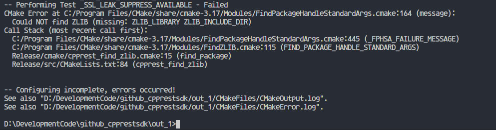
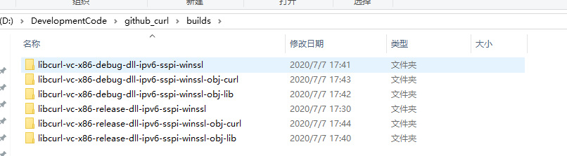
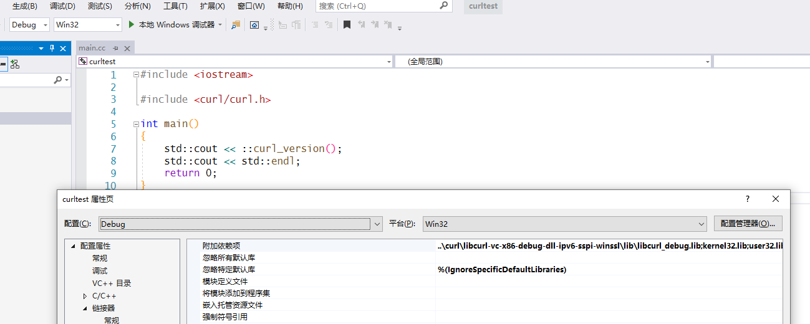
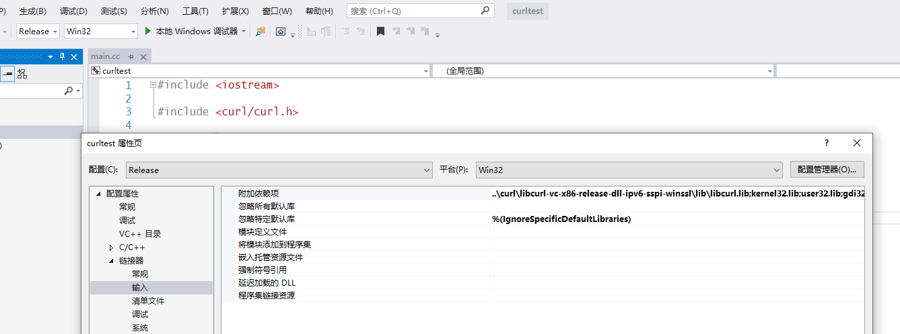

# <!-- fit -->CMake find_package 实战

代钤莹

---

*本文以一个问题入手，通过一个例子讲解find_package的用法，并非find_package命令的详尽讲解。*

---

## 遇到了什么问题

经常在一些通过CMake作为构建系统的开源代码中看到相关代码：

```cmake
find_package(Boost REQUIRED COMPONENTS system date_time regex)
find_package(OpenSSL 1.0.0 REQUIRED)
```

如果我们没有安装过相关的库，又没有修改CMake代码，往往无法成功生成项目

---



---

**即便能找到，我们仍然好奇为什么find_package能够正常工作！**

---

**让我们来了解下find_package！**

---

## 什么是 find_package

>Finds and loads settings from an external project.

简而言之，find_package 命令目的是**找到**外部项目并且从其中**加载**设置项

---

find_package有两种模式，分别是模块模式(Module Mode)和配置模式(Config Mode)。

---

### 模块模式

命令签名如下：

```cmake
find_package(<PackageName> [version] [EXACT] [QUIET] [MODULE]
             [REQUIRED] [[COMPONENTS] [components...]]
             [OPTIONAL_COMPONENTS components...]
             [NO_POLICY_SCOPE])
```

find_package 会尝试去指定目录调用```Find<PackageName>.cmake```脚本,如果找到包，那么 ```<PackageName>_FOUND```变量被设置为True，如果使用了```REQUIRED```参数，那么找不到包时会报错停止CMake脚本的执行。```Find<PackageName>.cmake```脚本可以定义一些该包需要使用的变量

---

这个指定路径是```CMAKE_MODULE_PATH```，可以通过以下代码来修改:```list(APPEND CMAKE_MODULE_PATH "path/to/dir/can/find/Find<PackageName>*.cmake")```

---

### 配置模式

命令签名如下

```cmake
find_package(<PackageName> [version] [EXACT] [QUIET]
             [REQUIRED] [[COMPONENTS] [components...]]
             [OPTIONAL_COMPONENTS components...]
             [CONFIG|NO_MODULE]
             [NO_POLICY_SCOPE]
             [NAMES name1 [name2 ...]]
             [CONFIGS config1 [config2 ...]]
             [HINTS path1 [path2 ... ]]
             [PATHS path1 [path2 ... ]]
             [PATH_SUFFIXES suffix1 [suffix2 ...]]
             [NO_DEFAULT_PATH]
             [NO_PACKAGE_ROOT_PATH]
             [NO_CMAKE_PATH]
             [NO_CMAKE_ENVIRONMENT_PATH]
             [NO_SYSTEM_ENVIRONMENT_PATH]
             [NO_CMAKE_PACKAGE_REGISTRY]
             [NO_CMAKE_BUILDS_PATH] # Deprecated; does nothing.
             [NO_CMAKE_SYSTEM_PATH]
             [NO_CMAKE_SYSTEM_PACKAGE_REGISTRY]
             [CMAKE_FIND_ROOT_PATH_BOTH |
              ONLY_CMAKE_FIND_ROOT_PATH |
              NO_CMAKE_FIND_ROOT_PATH])
```

---

形如```find_package(... CONFIG)```的形式是配置模式，特别的：不指定是模块模式则默认使用配置模式。在配置模式下， find_package 会尝试去指定目录下包含```<PackageName>Config.cmake``` 或者```<lower-case-package-name>-config.cmake```。

---

尝试搜索的目录是```<PackageName>_DIR```指定的路径，

---

### 版本选择

```[version]```参数被指定。CMake去寻找和要求版本号兼容的版本。如果指定```EXACT```参数，那么要求版本匹配否则查找失败。

CMake没有为版本号含义建立任何约定，版本号是由包本身提供的‘版本’文件来检查的，即```<config-file>Version.cmake```文件。

---

## find_package 实战

以一个libcurl的demo举例🌰

---

```c++
#include <iostream>

#include <curl/curl.h>

int main()
{
    std::cout << ::curl_version();
    std::cout << std::endl;
    return 0;
}
```

---

```cmake
cmake_minimum_required(VERSION 3.17)

set(LABELNAME curltest)

project(${LABELNAME})
add_executable(${LABELNAME} main.cc)

find_package(CURL)
message("CMAKE_MODULE_PATH is: " ${CMAKE_MODULE_PATH})

if(CURL_FOUND)
    target_include_directories(clib PRIVATE ${CURL_INCLUDE_DIR})
    target_link_libraries(${LABELNAME} ${CURL_LIBRARY})
else(CURL_FOUND)
    message(FATAL_ERROR ”CURL library not found”)
endif(CURL_FOUND)

```

---

CMake 提示无法找到CURL且生成过程被强制终止

```txt
-- Could NOT find CURL (missing: CURL_LIBRARY CURL_INCLUDE_DIR)
CMake Error at CMakeLists.txt:14 (message):
  ”CURLlibrarynotfound”


-- Configuring incomplete, errors occurred!
See also "D:/Pinco/开源文档/CMake FindPackage/find_curl_example/build/CMakeFiles/CMakeOutput.log".
```

---

### 模块模式使用curl

---

编译好的7.71.1版本curl



```libcurl-vc-x86-debug-dll-ipv6-sspi-winssl```和```libcurl-vc-x86-release-dll-ipv6-sspi-winssl```分别是debug版本和release版本动态库。

---

FindCURL.cmake

```cmake
set(PC_CURL_INCLUDE_DIRS 
    "${CMAKE_CURRENT_LIST_DIR}/../libcurl-vc-x86-debug-dll-ipv6-sspi-winssl/include"
)

find_path(CURL_INCLUDE_DIR 
    NAMES curl/curl.h
    HINTS ${PC_CURL_INCLUDE_DIRS}
)
mark_as_advanced(${CURL_INCLUDE_DIR})

set(PC_CURL_LIBRARY_DIRS
    "${CMAKE_CURRENT_LIST_DIR}/../libcurl-vc-x86-debug-dll-ipv6-sspi-winssl/lib"
    "${CMAKE_CURRENT_LIST_DIR}/../libcurl-vc-x86-release-dll-ipv6-sspi-winssl/lib"
)
find_library(CURL_LIBRARY_RELEASE 
    libcurl
    HINTS ${PC_CURL_LIBRARY_DIRS}
)
mark_as_advanced(CURL_LIBRARY_RELEASE)
message(${CURL_LIBRARY_RELEASE})

find_library(CURL_LIBRARY_DEBUG
    libcurl_debug
    HINTS ${PC_CURL_LIBRARY_DIRS}
)
mark_as_advanced(CURL_LIBRARY_DEBUG)
message(${CURL_LIBRARY_DEBUG})

#调用CMake脚本设置一些变量，具体可参考文档 
#相当于使用绝对路径 SelectLibraryConfigurations.cmake
include(SelectLibraryConfigurations)
select_library_configurations(CURL)

if (CURL_INCLUDE_DIR AND CURL_LIBRARY_DEBUG)
    set(CURL_FOUND TRUE)
endif()
```

---

项目CMakeList.txt

```cmake
cmake_minimum_required(VERSION 3.17)

set(LABELNAME curltest)

project(${LABELNAME})
add_executable(${LABELNAME} main.cc)

#设定优先级
set(CMAKE_MODULE_PATH "${CMAKE_SOURCE_DIR}/curl/cmake_module_mode;${CMAKE_MODULE_PATH}")
find_package(CURL MODULE)
message("CMAKE_MODULE_PATH is: " ${CMAKE_MODULE_PATH})

message("CURL_LIBRARY is: " ${CURL_LIBRARY})
if(CURL_FOUND)
    target_include_directories(${LABELNAME} PRIVATE ${CURL_INCLUDE_DIR})
    target_link_libraries(${LABELNAME} ${CURL_LIBRARY})
else(CURL_FOUND)
    message(FATAL_ERROR ”CURL library not found”)
endif(CURL_FOUND)
```

---



---



---

### 配置模式使用curl

---

CURLConfig.cmake

```cmake
#添加CURL动态库
add_library(CURL SHARED IMPORTED)

set(PC_CURL_LIBRARY_DIRS
    "${CMAKE_CURRENT_LIST_DIR}/../libcurl-vc-x86-debug-dll-ipv6-sspi-winssl/lib"
    "${CMAKE_CURRENT_LIST_DIR}/../libcurl-vc-x86-release-dll-ipv6-sspi-winssl/lib"
)
find_library(CURL_LIBRARY_RELEASE 
    libcurl
    HINTS ${PC_CURL_LIBRARY_DIRS}
)
mark_as_advanced(CURL_LIBRARY_RELEASE)
message(${CURL_LIBRARY_RELEASE})

find_library(CURL_LIBRARY_DEBUG
    libcurl_debug
    HINTS ${PC_CURL_LIBRARY_DIRS}
)
mark_as_advanced(CURL_LIBRARY_DEBUG)
message(${CURL_LIBRARY_DEBUG})

include(SelectLibraryConfigurations)
select_library_configurations(CURL)

set(CURL_INCLUDE_DIRS 
    "${CMAKE_CURRENT_LIST_DIR}/../libcurl-vc-x86-debug-dll-ipv6-sspi-winssl/include"
)

include_directories(${CURL_INCLUDE_DIRS})
set_target_properties(CURL PROPERTIES IMPORTED_LOCATION "${CURL_LIBRARYS}")
```

---

CMakeLists.txt

```cmake
cmake_minimum_required(VERSION 3.17)

set(LABELNAME curltest)

project(${LABELNAME})
add_executable(${LABELNAME} main.cc)

#告知CMake去哪里寻找<PackageName>Config.cmake文件
set(CURL_DIR "${CMAKE_SOURCE_DIR}/curl/cmake_config_mode")
find_package(CURL NO_MODULE)

message("CURL_LIBRARY is: " ${CURL_LIBRARY})
if(CURL_FOUND)
    target_include_directories(${LABELNAME} PRIVATE ${CURL_INCLUDE_DIR})
    target_link_libraries(${LABELNAME} ${CURL_LIBRARY})
else(CURL_FOUND)
    message(FATAL_ERROR ”CURL library not found”)
endif(CURL_FOUND)
```

---

## 总结

find_package 有模块模式和配置模式两种模式。

如果是自己写的库用配置模式比较方便，只需要在```<PackageName>Config.cmake```中指定头文件包含，库引用即可。

如果是使用第三方包，使用模块模式比较方便，CMake中已经包含了大量第三方库的```Find<PackageName>.cmake```脚本，直接使用又快又好。

---

## 谢谢 😍

**如文章有谬误， daiqianying@cvte.com 可直接指正，非常感谢！😝😝😝😝😝😝。**
