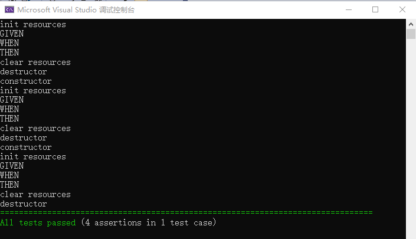

# Catch2 BDD

```c++
#define CATCH_CONFIG_MAIN
#include "../../../single_include/catch2/catch.hpp"

enum class State {
    kOff,
    kOn,
};

class Switcher {
public:
    Switcher() { std::cout << "constructor" << std::endl; }
    ~Switcher() { std::cout << "destructor" << std::endl; }

    void initState( State s ) { _s = s; }
    State getState() const { return _s; }
    void Process( State s ) { _s = s; }

private:
    State _s = State::kOff;
};

SCENARIO( "Switch on tests", "[switch_button]" ) {
    Switcher s;
    std::cout << "init resources" << std::endl;
    GIVEN( "the switch is on" ) {
        std::cout << "GIVEN" << std::endl;
        s.initState( State::kOn );
        WHEN( "process on" ) {
            std::cout << "WHEN" << std::endl;
            s.Process( State::kOn );
            THEN( "switch is on" ) {
                std::cout << "THEN" << std::endl;
                REQUIRE( s.getState() == State::kOn );
            }
        }
        WHEN( "process off" ) {
            std::cout << "WHEN" << std::endl;
            s.Process( State::kOff );
            THEN( "switch is off" ) {
                std::cout << "THEN" << std::endl;
                REQUIRE( s.getState() == State::kOff );
            }
        }
    }
    GIVEN( "the switch is off" ) {
        std::cout << "GIVEN" << std::endl;
        s.initState( State::kOff );
        WHEN( "process on" ) {
            std::cout << "WHEN" << std::endl;
            s.Process( State::kOn );
            THEN( "switch is on" ) {
                std::cout << "THEN" << std::endl;
                REQUIRE( s.getState() == State::kOn );
            }
        }
        WHEN( "process off" ) {
            std::cout << "WHEN" << std::endl;
            s.Process( State::kOff );
            THEN( "switch is off" ) {
                std::cout << "THEN" << std::endl;
                REQUIRE( s.getState() == State::kOff );
            }
        }
    }
    std::cout << "clear resources" << std::endl;
}
```


