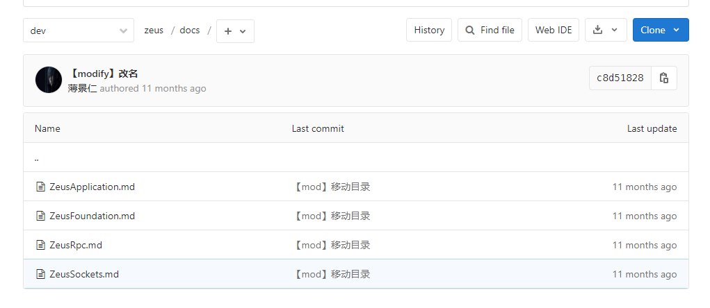
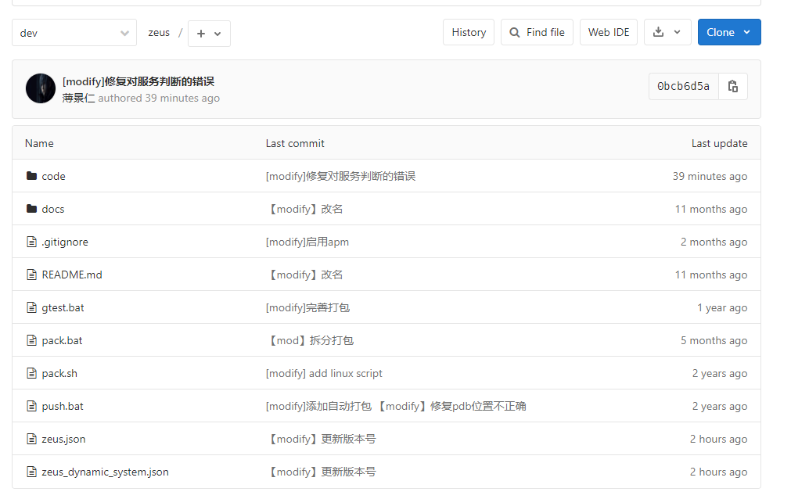
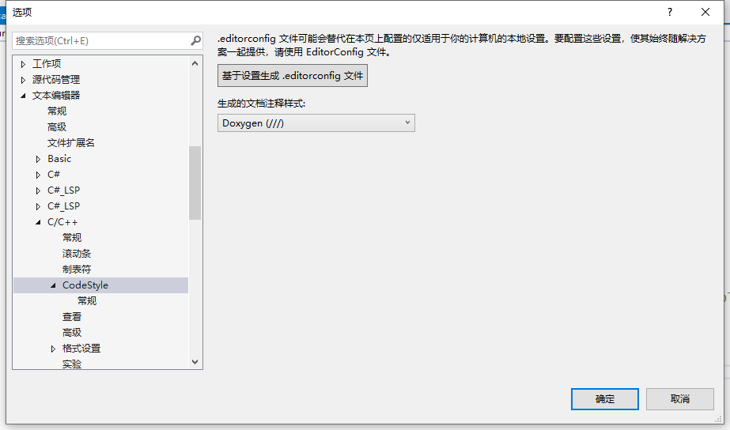
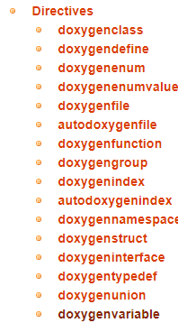
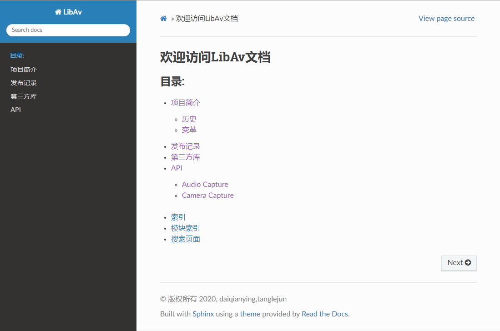
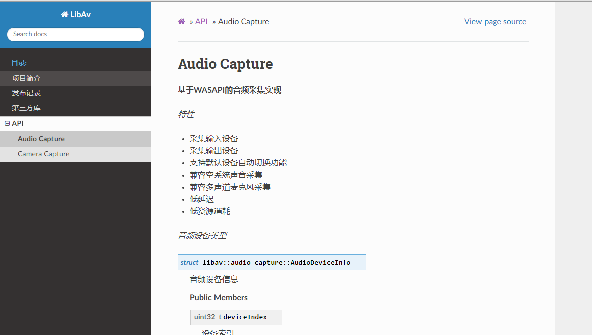

# <!-- fit -->Cmake+Sphinx+Doxygen+Breathe+Python+VisualStudio Extensions 自动化文档工作流

代钤莹

---

## 现在给项目写文档遇到的问题

---

### 代码和文档分离



zeus文档在单独的目录，源代码在单独的目录。为了解决这个方案可能需要开两个浏览器窗口一边看文档，一边对照看代码进行阅读解决自己使用库遇到的问题。

---

### 文档过时



zeus文档更新时间最近一次已经是11月了，代码更新是39分钟之前。疯狂打码一个月，一看文档新增0。

---

### 重复工作

文档中要对API进行详细讲解，需要拷贝代码到文档中，如果对API进行改进，那么文档也需要进行修改，不仅重复而且易错。

---

### 不便于浏览

使用markdown格式，依赖文件夹目录来表明目录层级，不便于浏览，也不便于管理。

---

### 代码注释没有合理利用

代码中有很多注释信息，这些信息如果想在文档中进行使用需要手动拷贝过去，与代码一样面临更新不及时的问题。

---

### 完全没有文档

写代码好累，再写文档我崩溃了。


---

**综合以上因素，我们知道写文档如果不借助工具往往是一件很不容易完成的目标。只有有大毅力的同学才能用这种原始的方法坚持完成。**


---

## 理想的项目文档编辑流程

1. 写代码的时顺手写注释
2. 写完代码自动生成文档
3. 文档中方便引用代码和注释信息
4. 文档自动部署
5. 在线浏览

---

## 介绍需要使用的工具

---

### 1.CMAKE

CMake是个一个开源的跨平台自动化建构系统，用来管理软件建置的程序，并不依赖于某特定编译器，并可支持多层目录、多个应用程序与多个库。非常强大，基本上开源工具都使用该工具。


---

### 2.Doxygen

Doxygen是一个适用于C++、C、Java、Objective-C、Python、IDL（CORBA和Microsoft flavors）、Fortran、VHDL、PHP、C#和D语言的文档生成器。


---

### 3.Sphinx

Sphinx是Python社区编写和使用的文档生成器，可以让轻松地创建智能和美丽的文档。Sphinx使用reStructuredText作为标记文档语法和解析系统，reStructuredText易读且好用，与Markdown类似。


---

### 4.Breathe

这是一个对reStructuredText和Sphinx的扩展，能够读取和渲染Doxygen xml输出。

---

### 5.Python

Sphinx和Breathe的运行都离不开Python。


---

### 6.VisualStudio Extensions

1. Format on save
保存时源码文件自动保存为UTF-8 With BOM，**Because UTF-8 is great**

2. Doxygen Comments
vs无法自动添加文件头的Doxygen格式注释，使用这个工具添加文件头注释。

---

### 7.VisualStudio 配置

配置C/C++ CodeStyle 注释风格为 Doxygen 风格，可快速完成函数注释。


---

## 文档工作流

编写源码时按照规范填写注释 -> 构建解决方案 -> Doxygen处理源码生成XML和HTML文档 -> Sphinx处理文档，通过Breathe插件读取Doxygen的XML资源生成HTML文档 -> 浏览器访问index.html

---

## 文档工作流配置

---

### Sphinx配置

创建sphinx工作目录

```bash
sphinx-quickstart.exe
```

config.py配置

```python
extensions = [ "breathe" ]
breathe_default_project = "LibAV"
breathe_projects = {
    "LibAV": "path/to/Libav/doxygen/xml/folder",
    "LibBV": "path/to/Libav/doxygen/xml/folder"
}
```

breathe_projects的项目和对应xml路径可通过sphinx-build.exe命令行参数传递

---

### Doxygen配置

生成默认配置

```bash
doxygen.exe -g
```

修改配置，仅列举部分选项，其他选项可查阅配置文件注释

```
PROJECT_NAME           = "LibAV"
OUTPUT_DIRECTORY       = "@DOXYGEN_OUTPUT_DIR@"
OUTPUT_DIRECTORY       = "@DOXYGEN_OUTPUT_DIR@"
OUTPUT_LANGUAGE        = English
GENERATE_LATEX         = NO
```

---

### Sphinx文档中引用Doxygen

引用结构体

```
.. doxygenstruct:: libav::audio_capture::AudioDeviceInfo
    :project: LibAV
    :members:
    :outline:
```

这是一条指令，指令名称为doxygenstruct；指令参数为libav::audio_capture::AudioDeviceInfo，参数支持换行，参数按行分割；::中是指令选项，选项必须和指令有相同的缩进；指令的内容与最后一行选项隔开一个空行，必须与指令具有相同的缩进

---

支持引用的类型


更多内容参考()[https://breathe.readthedocs.io/en/latest/directives.html]

---

## LibAV新文档效果



---


